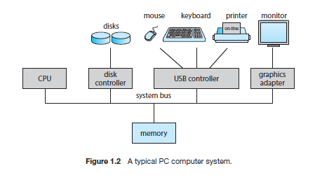

## Computer System Organization
in &#x1F1FA;&#x1F1F8;

### Bus
- A number of device controllers connected through a common **bus**.

- Provides access between components and shared memory.

### Device Controller
- In charge of a specific type of device.
(e.g. a disk drive, audio device, or graphic display)

- Depending on the controller, more than one device may be attached.

- Maintains some local buffer storage and a set of special-purpose registers.

### Device Driver
Operating systems have a device driver for each device controller.

Understands the device controller and provides the reset of the operating system with a uniform interface to the device.

To ensure orderly access to the shared memory, a memory controller synchronizes access to the memory.

